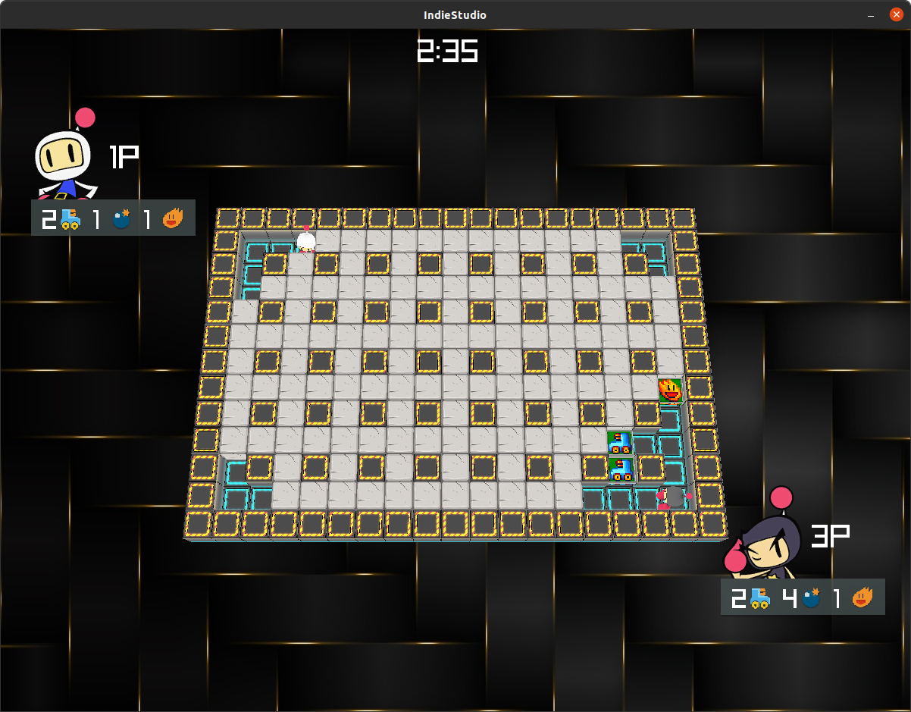

# IndieStudio

The aim of the Indie Studio is to implement a local multiplayer cross-platform 3D bomberman.

Clone the repository:

    git clone https://github.com/MayaHill/IndieStudio.git

### Linux Installer

Install boost:

    sudo apt-get install libboost-all-dev

To compile:
    ./launch.sh build

## Launch the game
    ./bomberman

### Windows Installer

Install boost:

    https://boostorg.jfrog.io/artifactory/main/release/1.79.0/source/boost_1_79_0.7z

To compile:
    launch the ./launch.ps1 on visual studio
